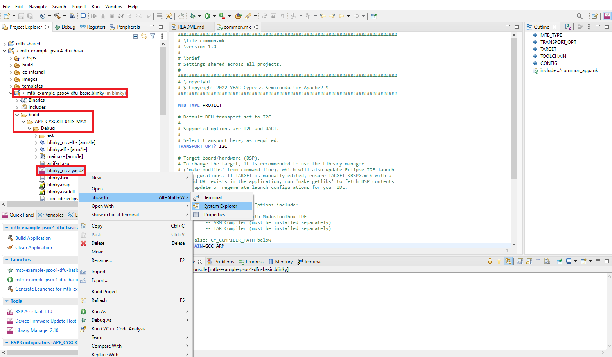

# PSoC&trade; 4: Basic device firmware upgrade (DFU)

This example demonstrates how to create a field upgradable project for PSoC&trade; 4 using the DFU middleware.
The device firmware update (DFU) will occur over the I2C or UART interfaces. This includes downloading an application from a host device (PC/MCU) and installing it in PSoC&trade; 4 device flash.
 This document details the following:
1. A high-level overview of the DFU process described in [Design and Implementation](#design-and-implementation) section.
2. An example to show how to install the DFU firmware inside the flash of the target device and upload an application code via I2C or UART.

This example bundles two applications:

**Bootloader app:** Implements a [DFU middleware library](https://github.com/Infineon/dfu) based basic bootloader application run by the CPU. The bootloader handles image download, verification, erase, and upgradation process. When the image is valid, the bootloader lets the CPU boot the application.

**Blinky app:** This is a tiny application run by the CPU that blinks an LED at a 5-Hz rate continuously. This application transfers control to the bootloader when the user button is pressed. Here the application project is a simple Blinky project, but user can change this according to their needs.

**Note:** For the `CY8CKIT-040T` Kit only *I2C* is available as the DFU transport layer. Also, switching between application and bootloader will be controlled by an I2C command rather than a button press.

[View this README on GitHub.](https://github.com/Infineon/mtb-example-psoc4-dfu-basic)

[Provide feedback on this code example.](https://cypress.co1.qualtrics.com/jfe/form/SV_1NTns53sK2yiljn?Q_EED=eyJVbmlxdWUgRG9jIElkIjoiQ0UyMzYzOTUiLCJTcGVjIE51bWJlciI6IjAwMi0zNjM5NSIsIkRvYyBUaXRsZSI6IlBTb0MmdHJhZGU7IDQ6IEJhc2ljIGRldmljZSBmaXJtd2FyZSB1cGdyYWRlIChERlUpIiwicmlkIjoiZGFzYXZpaml0IiwiRG9jIHZlcnNpb24iOiIxLjEuMCIsIkRvYyBMYW5ndWFnZSI6IkVuZ2xpc2giLCJEb2MgRGl2aXNpb24iOiJNQ0QiLCJEb2MgQlUiOiJJQ1ciLCJEb2MgRmFtaWx5IjoiUFNPQyJ9)

## Requirements

- [ModusToolbox&trade; software](https://www.infineon.com/cms/en/design-support/tools/sdk/modustoolbox-software) v3.1 or later

**Note:** This code example version requires ModusToolbox&trade; software version 3.1 and is not backward compatible with v3.0 or older versions.

- Board support package (BSP) minimum required version: 3.1.0

- Programming language: C

- Associated parts: All [PSoC&trade; 4 MCU](https://www.infineon.com/cms/en/product/microcontroller/32-bit-psoc-arm-cortex-microcontroller/psoc-4-32-bit-arm-cortex-m0-mcu/) parts

## Supported toolchains (make variable 'TOOLCHAIN')

- GNU Arm&reg; Embedded Compiler v11.3.1 (`GCC_ARM`) - Default value of `TOOLCHAIN`
- Arm&reg; Compiler v6.16 (`ARM`)
- IAR C/C++ Compiler v9.30.1 (`IAR`)


## Supported kits (make variable 'TARGET')

- [PSoC&trade; 4100S Max Pioneer Kit](https://www.infineon.com/CY8CKIT-041S-MAX/) (`CY8CKIT-041S-MAX`) - Default value of `TARGET`
- [PSoC&trade; 4100S Plus Prototyping Kit](https://www.infineon.com/cms/en/product/evaluation-boards/cy8ckit-149/) (`CY8CKIT-149`)
- [PSoC&trade; 4000S CAPSENSE&trade; Prototyping Kit](https://www.infineon.com/cms/en/product/evaluation-boards/cy8ckit-145-40xx/) (`CY8CKIT-145-40XX`)
- [PSoC&trade; 4500S Pioneer Kit](https://www.infineon.com/CY8CKIT-045S) (`CY8CKIT-045S`)
- [PSoC&trade; 4000T CAPSENSE&trade; Evaluation Kit](https://www.infineon.com/CY8CKIT-040T/) (`CY8CKIT-040T`)

## Supported transports (make variable 'TRANSPORT_OPT')

The default transport is I2C. See the [Operation](#operation) section for instructions to change the transport option,  `TRANSPORT_OPT`.

 TARGET | UART | I2C |
 :----- | :--- | :--- |
 CY8CKIT-041S-MAX | Yes | Yes |
 CY8CKIT-149 | Yes | Yes |
 CY8CKIT-145-40XX | Yes | Yes |
 CY8CKIT-045S | Yes | Yes |
 CY8CKIT-040T | No  | Yes |

## Hardware setup

This example uses the board's default configuration. See the kit user guide to ensure that the board is configured correctly.

**Note:** Some of the kits mentioned in this code example ship with an older version of KitProg Firmware installed. You can upgrade to the latest version of the KitProg Firmware. The tool and instructions are available in the [Firmware loader](https://github.com/Infineon/Firmware-loader) GitHub repository. If you do not upgrade, you will get a warning "KitProg firmware is out of date, please update to the latest version".

## Using the code example

Create the project and open it using one of the following:

<details><summary><b>In Eclipse IDE for ModusToolbox&trade; software</b></summary>

1. Click the **New Application** link in the **Quick Panel** (or, use **File** > **New** > **ModusToolbox&trade; Application**). This launches the [Project Creator](https://www.infineon.com/ModusToolboxProjectCreator) tool.

2. Pick a kit supported by the code example from the list shown in the **Project Creator - Choose Board Support Package (BSP)** dialog.

   When you select a supported kit, the example is reconfigured automatically to work with the kit. To work with a different supported kit later, use the [Library Manager](https://www.infineon.com/ModusToolboxLibraryManager) to choose the BSP for the supported kit. You can use the Library Manager to select or update the BSP and firmware libraries used in this application. To access the Library Manager, click the link from the **Quick Panel**.

   You can also just start the application creation process again and select a different kit.

   If you want to use the application for a kit not listed here, you may need to update the source files. If the kit does not have the required resources, the application may not work.

3. In the **Project Creator - Select Application** dialog, choose the example by enabling the checkbox.

4. (Optional) Change the suggested **New Application Name**.

5. The **Application(s) Root Path** defaults to the Eclipse workspace which is usually the desired location for the application. If you want to store the application in a different location, you can change the *Application(s) Root Path* value. Applications that share libraries should be in the same root path.

6. Click **Create** to complete the application creation process.

For more details, see the [Eclipse IDE for ModusToolbox&trade; software user guide](https://www.infineon.com/MTBEclipseIDEUserGuide) (locally available at *{ModusToolbox&trade; software install directory}/docs_{version}/mt_ide_user_guide.pdf*).

</details>

<details><summary><b>In command-line interface (CLI)</b></summary>

ModusToolbox&trade; software provides the Project Creator as both a GUI tool and the command line tool, "project-creator-cli". The CLI tool can be used to create applications from a CLI terminal or from within batch files or shell scripts. This tool is available in the *{ModusToolbox&trade; software install directory}/tools_{version}/project-creator/* directory.

Use a CLI terminal to invoke the "project-creator-cli" tool. On Windows, use the command line "modus-shell" program provided in the ModusToolbox&trade; software installation instead of a standard Windows command-line application. This shell provides access to all ModusToolbox&trade; software tools. You can access it by typing `modus-shell` in the search box in the Windows menu. In Linux and macOS, you can use any terminal application.

This tool has the following arguments:

Argument | Description | Required/optional
---------|-------------|-----------
`--board-id` | Defined in the `<id>` field of the [BSP](https://github.com/Infineon?q=bsp-manifest&type=&language=&sort=) manifest | Required
`--app-id`   | Defined in the `<id>` field of the [CE](https://github.com/Infineon?q=ce-manifest&type=&language=&sort=) manifest | Required
`--target-dir`| Specify the directory in which the application is to be created if you prefer not to use the default current working directory | Optional
`--user-app-name`| Specify the name of the application if you prefer to have a name other than the example's default name | Optional

<br>

The following example will clone the "[PSoC&trade; 4: Basic device firmware upgrade (DFU)](https://github.com/Infineon/mtb-example-psoc4-dfu-basic)" application with the desired name "MyDFU" configured for the *CY8CKIT-041S-MAX* BSP into the specified working directory, *C:/mtb_projects*:

   ```
   project-creator-cli --board-id CY8CKIT-041S-MAX --app-id mtb-example-psoc4-dfu-basic --user-app-name MyDFU --target-dir "C:/mtb_projects"
   ```

**Note:** The project-creator-cli tool uses the `git clone` and `make getlibs` commands to fetch the repository and import the required libraries. For details, see the "Project creator tools" section of the [ModusToolbox&trade; software user guide](https://www.infineon.com/ModusToolboxUserGuide) (locally available at *{ModusToolbox&trade; software install directory}/docs_{version}/mtb_user_guide.pdf*).
   
To work with a different supported kit later, use the [Library Manager](https://www.infineon.com/ModusToolboxLibraryManager) to choose the BSP for the supported kit. You can invoke the Library Manager GUI tool from the terminal using `make modlibs` command or use the Library Manager CLI tool "library-manager-cli" to change the BSP.

The "library-manager-cli" tool has the following arguments:

Argument | Description | Required/optional
---------|-------------|-----------
`--add-bsp-name` | Name of the BSP that should be added to the application | Required
`--set-active-bsp` | Name of the BSP that should be as active BSP for the application | Required
`--add-bsp-version`| Specify the version of the BSP that should be added to the application if you do not wish to use the latest from manifest | Optional
`--add-bsp-location`| Specify the location of the BSP (local/shared) if you prefer to add the BSP in a shared path | Optional

<br />

Following example adds the CY8CKIT-041S-MAX BSP to the already created application and makes it the active BSP for the app:

   ```
   library-manager-cli --project "C:/mtb_projects/MyDFU" --add-bsp-name CY8CKIT-041S-MAX --add-bsp-version "latest-v4.X" --add-bsp-location "local"

   library-manager-cli --project "C:/mtb_projects/MyDFU" --set-active-bsp APP_CY8CKIT-041S-MAX
   ```

</details>

<details><summary><b>In third-party IDEs</b></summary>

Use one of the following options:

- **Use the standalone [Project Creator](https://www.infineon.com/ModusToolboxProjectCreator) tool:**

   1. Launch Project Creator from the Windows Start menu or from *{ModusToolbox&trade; software install directory}/tools_{version}/project-creator/project-creator.exe*.

   2. In the initial **Choose Board Support Package** screen, select the BSP, and click **Next**.

   3. In the **Select Application** screen, select the appropriate IDE from the **Target IDE** drop-down menu.

   4. Click **Create** and follow the instructions printed in the bottom pane to import or open the exported project in the respective IDE.

<br>

- **Use command-line interface (CLI):**

   1. Follow the instructions from the **In command-line interface (CLI)** section to create the application.

   2. Export the application to a supported IDE using the `make <ide>` command.

   3. Follow the instructions displayed in the terminal to create or import the application as an IDE project.

For a list of supported IDEs and more details, see the "Exporting to IDEs" section of the [ModusToolbox&trade; software user guide](https://www.infineon.com/ModusToolboxUserGuide) (locally available at *{ModusToolbox&trade; software install directory}/docs_{version}/mtb_user_guide.pdf*).

</details>

The project has the necessary settings by default. The **Operation** section describes how to test the example. 

## Operation

1. Connect the board to your PC using the provided USB cable through the KitProg3 USB connector.

2. Build the project that bundles the bootloader and the blinky application together, by selecting 'mtb-example-psoc4-dfu-basic' and clicking on 'Build Application' as shown in **Figure 1**.

   **Figure 1. Building the application**  
   

   **Note:** *I2C* is configured as the default DFU transport. To change the DFU transport, edit the **common.mk** makefile to set `TRANSPORT_OPT?=<transport>` before building the project. As shown in **Figure 2**.

   **Figure 2. TRANSPORT_OPT**  
   

3. Flashing the bootloader
   <details><summary><b>Using Eclipse IDE for ModusToolbox&trade; software</b></summary>

      1. Select the bootloader_cm0p project (*mtb-example-psoc4-dfu-basic.bootloader_cm0p*) in the Project Explorer.

      2. In the **Quick Panel**, scroll down to launches, and click **mtb-example-psoc4-dfu-basic.bootloader_cm0p Program (KitProg3_MiniProg4)**.

      **Figure 3. Flashing the bootloader**  
      

   </details>

   <details><summary><b>Using CLI</b></summary>

     From the terminal, execute the `make program` command to build and program the application using the default toolchain to the default target with default DFU transport. You can specify a target, toolchain and transport manually:
      ```
      make program TOOLCHAIN=<toolchain>
      ```

      Example:
      ```
      make program TOOLCHAIN=GCC_ARM
      ```
      **Note:** The *TOOLCHAIN* variable can also be found on the **common.mk** makefile and can be changed according to the user. However the user has to provide the compiler path in the variable named *CY_COMPILER_PATH=* in the makefiles of both the Bootloader and the Blinky.
   </details>

4. After programming, Bootloader starts automatically and starts blinking the USER LED at approximately 1 Hz.

5. Perform the device firmware upgrade using the **DFU host tool**:

   a. Open the [Device Firmware Upgrade host tool](https://www.infineon.com/dgdlac/Infineon-ModusToolbox_Device_Firmware_Update_Host_Tool_%28Version_1.2%29-Software-v01_00-EN.pdf?fileId=8ac78c8c7d0d8da4017d0f8d42ba76bb) under the **Tools** section in **Quick Panel**. Plug in the Kit.
      
      **Figure 4. The Device Firmware Upgrade host tool**  
      

   b. Make a note of the path to the **blinky_cm0p_crc.cyad2** file. This will be needed for configuring the DFU Host tool. By default, it will be generated in the *mtb-example-psoc4-dfu-basic/blinky_cm0p/build/APP_CY8CKIT-041S-MAX/Debug* directory. Paste this path in the _File:_ field of the DFU Host Tool.

      **Note:** CY8CKIT-041S-MAX is the target kit in this example. If you are using different kit the name of the 'APP_xxx' folder inside the _build_ folder will change accordingly.

      **Figure 5. Locating the \*.cyacd2 file**  
        

   c. Select the appropriate port based on the transport (`TRANSPORT_OPT`) configured in the **common.mk** makefile. 
   *I2C* is the default transport configuration, and the default parameters are:
   - I2C speed = 400kHz
   - I2C address = 12

   If you are using *UART* as the transport, the default parameters are:
   - Baud = 115200
   - Data  bits = 8
   - Stop bits = 1
   - Parity = None

      **Figure 6. Setting up the DFU Host Tool**  
      

   d. Click **Program**. Observe the image download progress status on the progress bar, and wait for the download to  complete.
      
      **Figure 7. Uploading the application firmware**               
         

      **Note:** See [DFU host tool](https://www.infineon.com/dgdlac/Infineon-ModusToolbox_Device_Firmware_Update_Host_Tool_%28Version_1.2%29-Software-v01_00-EN.pdf?fileId=8ac78c8c7d0d8da4017d0f8d42ba76bb) documentation for further details on selecting a port and configuring it for communication based on the transport enabled in the bootloader.

   After the successful download of the application firmware, the device will boot to *blinky_cm0p* project. Observe the user LED blinking at 5 Hz.

   **Note:** If you observe **Program** or other actions failing to execute, it is likely that the device was previously programmed and, upon reset, the bootloader is booting to the previous application every time. To solve this issue, erase the whole device flash by running *make erase* command in the terminal as shown in **Figure 8**, and repeat steps from Step 3.

      **Figure 8. Erasing the device chip**               
      

<br>

### Switching between *bootloader* and *application*

**For kits other than `CY8CKIT-040T`**

Dynamic switching between the bootloader and the application is triggered by user button events. Press the user button to switch to the bootloader while the application is running. Similarly, press the user button to switch to the application while the bootloader is running. Note that a switching request will be honored by the bootloader only if there is a valid application in the memory.

**For `CY8CKIT-040T` Kit**

Dynamic switching between the bootloader and the application is triggered by sending commands over I2C. 
To send the commands a USB to I2C bridge and a I2C Serial Terminal Software like *Bridge Control Panel* (BCP) can be used. BCP is included with the installation of [PSoC&trade; Programmer](https://www.infineon.com/cms/en/design-support/tools/programming-testing/psoc-programming-solutions/). To know how to write data using BCP, refer to the **Help Topics** section under the **Help** tab in the menu bar. CY8CKIT-040T Kit has an onboard  KitProg which can act as the USB to I2C bridge, and it is already connected to the I2C bus of the PSoC&trade; 4000T device.


To switch to the Bootloader while the application is running, send the following 3 bytes to the I2C address `0x0C`, using BCP, as shown in **Figure 9**.
```
0x01 0xEA 0x17
```
   **Figure 9. BCP command 1**  
   

The command follows a basic packet structure that consists of Start Of Packet(SOP): 0x01, Command Byte (this is the actual command to trigger a flag in the main.c): 0xEA, and End Of Packet(EOP): 0x17.

And to switch from Bootloader to the Application send the following 7 bytes to the I2C address `0x0C`.
```
0x01 0x3B 0x00 0x00 0xC4 0xFF 0x17
```
   **Figure 10. BCP command 2**  
   

 The **Exit Bootloader** command is an integrated command given by DFU MW. The command details and the packet structure can be found in the Host **command/response** protocol Section of the Application Note [AN236282 - Device firmware update (DFU) middleware (MW) FOR ModusToolbox&trade;](https://www.infineon.com/AN236282).

 Note that a switching request will be honored by the bootloader to jump to application only if there is a valid application in the memory.


## Debugging

You can debug the example to step through the code. In the IDE, use the **\<Application Name> Debug (KitProg3_MiniProg4)** configuration in the **Quick Panel**. For details, see the "Program and debug" section in the [Eclipse IDE for ModusToolbox&trade; software user guide](https://www.infineon.com/MTBEclipseIDEUserGuide).


## Design and implementation

### Overview

This example demonstrates the basic device firmware upgrade (DFU) operations based on the [DFU middleware library](https://github.com/Infineon/dfu).
   **Figure 11. Bootloader Flow Diagram**  
   

### Bootloader implementation

This bootloader_cm0p project implements an immutable bootloader with support for upgrading the application firmware over I2C or UART.

The [DFU host tool](https://www.infineon.com/dgdlac/Infineon-ModusToolbox_Device_Firmware_Update_Host_Tool_%28Version_1.2%29-Software-v01_00-EN.pdf?fileId=8ac78c8c7d0d8da4017d0f8d42ba76bb) (typically running on the host PC) sends the application (*\<APPNAME>.cyacd2*) to the device. The bootloader receives the application image in chunks and overwrites the existing application image. See **Figure 11**. If a DFU session is interrupted, the application firmware will not be in a usable state. However, the device can still run the bootloader and perform necessary actions to download and install the application in subsequent DFU sessions.

**Figure 12. DFU design overview**  
      


### DFU interfaces

The project supports *I2C* or *UART* interfaces for communicating with the DFU host. The *config* directory in the *mtb-example-psoc4-dfu-basic/bsps/TARGET_APP_CY8CKIT-041S-MAX/config* includes all the necessary configurations to select the supported interfaces. These configurations can also be edited or reconfigured using the *Design Configurator* under the *BSP Configurators* in the *Quick Panel*.

**Note:** The Device Configurator is common for both the bootloader and the application thus the resources are shared among them.

   **Figure 13. Design Configurator**  
   

See the following table for the default configuration details. These default configurations can be changed according to the use case. However, you must ensure that the configuration of the DFU host tool matches with that of the project.

**DFU transport configurations**

  By default both the *I2C* and the *UART* modes are enabled and configured for the transport. For more details on transport resources refer to [Resources and settings](#resources-and-settings).

**Default I2C Configuration**

  Parameter| Default Setting|Description
   :--------------- | :------ | :-----
   Mode  | Slave | Device acts as a slave
   Address | 12  | 7-bit slave device address
   Data rate |400 kbps| DFU supports standard data rates from 50 kbps to 1 Mbps

   **Figure 14. I2C configuration**  
   

   <br>

**Default UART Configuration**

   Parameter| Default Setting|Description
   :--------------- | :------ | :-----
   Com Mode | Standard | Standard, SmartCard, and IrDA are supported UART modes in SCB
   Baud rate(bps)|115200 | Supports standard baud rates from 19200 to 115200
   Bit order| LSB first| Standard frame
   Data width| 8 bits| Standard frame
   Parity| None | Standard frame
   Stop bits| 1 bit | Standard frame
   
   
   **Figure 15. UART configuration**  
   
   
   <br>


### Memory layout

The first 16KB region of the Flash is reserved for the bootloader followed by a 4KB reserved region for future enhancements. Another 32KB is allocated to the application firmware followed by the empty/reserved region. The size of this Empty/Reserved region depends on the size of the flash available on the selected target device. See respective device datasheets for details. The last 256B region of the flash is reserved for bootloader metadata.

To change the memory layout or usage, update the respective target linker script. The files are found in the *BSPs* folder. 
For Example: *mtb-example-psoc4-dfu-basic/bsps/TARGET_APP_CY8CKIT-041S-MAX/COMPONENT_CM0p/TOOLCHAIN_GCC_ARM*

**Figure 16. Linker scripts**  
   

There are two linker scripts, one for each of the application in the corresponding toolchain directory. Here in the TOOLCHAIN_GCC_ARM directory the _dfu_cm0p_app0.ld_ linker script is for the Bootloader and the _dfu_cm0p_app1.ld_ linker script is for the Blinky. The linker scripts can also be modified to define dedicated regions of the memory for each application.

The RAM is shared by the bootloader and the blinky applications, with a common area used by both projects. The RAM regions must be aligned to the 1KB boundary because they contain the interrupt vector table remapped at the start.

   **Figure 17. Flash layout of CY8CKIT-041S-MAX**  
   
   
   <br>

### Software reset

When transferring the control from one application to another, the recommended method is through a device software reset. This enables each application to initialize device hardware blocks and signal routing from a known state. It is possible to freeze the state of I/O pins so that they are maintained through a software reset. Defined portions of the SRAM are also maintained through a software reset. For more information, see the device-specific technical reference manual (TRM).


### Resources and settings

**Table 1. Bootloader resources**

 Resource  |  Alias/object     |    Purpose
 :------- | :------------    | :------------
 SCB (I2C) (PDL) | DFU_I2C          | I2C slave driver to communicate with the DFU host
 SCB (UART)(PDL) | DFU_UART          | UART driver to communicate with the DFU host
 GPIO (PDL)    | CYBSP_USER_LED         | User LED
 GPIO (PDL)    | CYBSP_USER_BTN         | User button

**Note:** The *Alias/Name* must be DFU_\<TRANSPORT_OPT> to support DFU communication API. Like DFU_I2C for I2C and DFU_UART for UART.
<br>

**Table 2. Application resources**

 Resource  |  Alias/object     |    Purpose
 :------- | :------------    | :------------
 GPIO (PDL)    | CYBSP_USER_LED         | User LED
 GPIO (PDL)    | CYBSP_USER_BTN         | User button

<br>

## Related resources


Resources  | Links
-----------|----------------------------------
Application notes  | [AN79953](https://www.infineon.com/AN79953) - Getting started with PSoC&trade; 4 <br>  [AN236282](https://www.infineon.com/AN236282) - Device Firmware Update (DFU) Middleware (MW) for ModusToolbox&trade;
Code examples  | [Using ModusToolbox&trade; software](https://github.com/Infineon/Code-Examples-for-ModusToolbox-Software) on GitHub
Device documentation | [PSoC&trade; 4 MCU datasheets](https://edit.infineon.com/cms/en/search.html?intc=searchkwr-return&_ga=2.236871304.809459600.1667797660-717891995.1665054803#!view=downloads&term=PSOC4&doc_group=Data%20Sheet) <br> [PSoC&trade; 4 technical reference manuals](https://www.infineon.com/cms/en/search.html#!term=Psoc%204%20technical%20reference%20manual&view=all)
Development kits | Select your kits from the [Evaluation Board](https://www.infineon.com/cms/en/design-support/finder-selection-tools/product-finder/evaluation-board) Finder page.
Libraries on GitHub  | [mtb-pdl-cat2](https://github.com/Infineon/mtb-pdl-cat2) - PSoC&trade; 4 Peripheral Driver Library (PDL)  <br> [mtb-hal-cat2](https://github.com/Infineon/mtb-hal-cat2) - Hardware Abstraction Layer (HAL) library
Middleware on GitHub  | [Device Firmware Update (DFU) Middleware Library](https://github.com/Infineon/dfu) - Links to DFU SDK middleware
Tools  | [Eclipse IDE for ModusToolbox&trade; software](https://www.infineon.com/modustoolbox) - ModusToolbox&trade; software is a collection of easy-to-use software and tools enabling rapid development with Infineon MCUs, covering applications from embedded sense and control to wireless and cloud-connected systems using AIROC&trade; Wi-Fi and Bluetooth&trade; connectivity devices.

<br>

## Other resources

Infineon provides a wealth of data at [www.infineon.com](www.infineon.com) to help you select the right device, and quickly and effectively integrate it into your design.

## Document history

Document title: *CE236395* - *PSoC&trade; 4: Basic device firmware upgrade (DFU)*

 Version | Description of change
 ------- | ---------------------
 1.0.0   | New code example
 1.1.0   | Updated Linker files


<br>

---------------------------------------------------------

© Cypress Semiconductor Corporation, 2023. This document is the property of Cypress Semiconductor Corporation, an Infineon Technologies company, and its affiliates ("Cypress").  This document, including any software or firmware included or referenced in this document ("Software"), is owned by Cypress under the intellectual property laws and treaties of the United States and other countries worldwide.  Cypress reserves all rights under such laws and treaties and does not, except as specifically stated in this paragraph, grant any license under its patents, copyrights, trademarks, or other intellectual property rights.  If the Software is not accompanied by a license agreement and you do not otherwise have a written agreement with Cypress governing the use of the Software, then Cypress hereby grants you a personal, non-exclusive, nontransferable license (without the right to sublicense) (1) under its copyright rights in the Software (a) for Software provided in source code form, to modify and reproduce the Software solely for use with Cypress hardware products, only internally within your organization, and (b) to distribute the Software in binary code form externally to end users (either directly or indirectly through resellers and distributors), solely for use on Cypress hardware product units, and (2) under those claims of Cypress’s patents that are infringed by the Software (as provided by Cypress, unmodified) to make, use, distribute, and import the Software solely for use with Cypress hardware products.  Any other use, reproduction, modification, translation, or compilation of the Software is prohibited.
<br>
TO THE EXTENT PERMITTED BY APPLICABLE LAW, CYPRESS MAKES NO WARRANTY OF ANY KIND, EXPRESS OR IMPLIED, WITH REGARD TO THIS DOCUMENT OR ANY SOFTWARE OR ACCOMPANYING HARDWARE, INCLUDING, BUT NOT LIMITED TO, THE IMPLIED WARRANTIES OF MERCHANTABILITY AND FITNESS FOR A PARTICULAR PURPOSE.  No computing device can be absolutely secure.  Therefore, despite security measures implemented in Cypress hardware or software products, Cypress shall have no liability arising out of any security breach, such as unauthorized access to or use of a Cypress product. CYPRESS DOES NOT REPRESENT, WARRANT, OR GUARANTEE THAT CYPRESS PRODUCTS, OR SYSTEMS CREATED USING CYPRESS PRODUCTS, WILL BE FREE FROM CORRUPTION, ATTACK, VIRUSES, INTERFERENCE, HACKING, DATA LOSS OR THEFT, OR OTHER SECURITY INTRUSION (collectively, "Security Breach").  Cypress disclaims any liability relating to any Security Breach, and you shall and hereby do release Cypress from any claim, damage, or other liability arising from any Security Breach.  In addition, the products described in these materials may contain design defects or errors known as errata which may cause the product to deviate from published specifications. To the extent permitted by applicable law, Cypress reserves the right to make changes to this document without further notice. Cypress does not assume any liability arising out of the application or use of any product or circuit described in this document. Any information provided in this document, including any sample design information or programming code, is provided only for reference purposes.  It is the responsibility of the user of this document to properly design, program, and test the functionality and safety of any application made of this information and any resulting product.  "High-Risk Device" means any device or system whose failure could cause personal injury, death, or property damage.  Examples of High-Risk Devices are weapons, nuclear installations, surgical implants, and other medical devices.  "Critical Component" means any component of a High-Risk Device whose failure to perform can be reasonably expected to cause, directly or indirectly, the failure of the High-Risk Device, or to affect its safety or effectiveness.  Cypress is not liable, in whole or in part, and you shall and hereby do release Cypress from any claim, damage, or other liability arising from any use of a Cypress product as a Critical Component in a High-Risk Device. You shall indemnify and hold Cypress, including its affiliates, and its directors, officers, employees, agents, distributors, and assigns harmless from and against all claims, costs, damages, and expenses, arising out of any claim, including claims for product liability, personal injury or death, or property damage arising from any use of a Cypress product as a Critical Component in a High-Risk Device. Cypress products are not intended or authorized for use as a Critical Component in any High-Risk Device except to the limited extent that (i) Cypress’s published data sheet for the product explicitly states Cypress has qualified the product for use in a specific High-Risk Device, or (ii) Cypress has given you advance written authorization to use the product as a Critical Component in the specific High-Risk Device and you have signed a separate indemnification agreement.
<br>
Cypress, the Cypress logo, and combinations thereof, WICED, ModusToolbox, PSoC, CapSense, EZ-USB, F-RAM, and Traveo are trademarks or registered trademarks of Cypress or a subsidiary of Cypress in the United States or in other countries. For a more complete list of Cypress trademarks, visit cypress.com. Other names and brands may be claimed as property of their respective owners.
